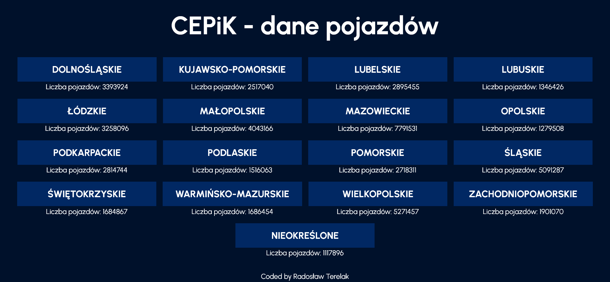

# CEPiK Car Database using Angular

## Table of contents

- [Overview](#overview)
  - [Screenshot](#screenshot)
  - [Links](#links)
- [My process](#my-process)
  - [Built with](#built-with)
  - [What I learned](#what-i-learned)
- [Author](#author)

## Overview

### Screenshot

### Links

- Live Site URL: [CEPiK CAR DATABASE](https://cepik-car-database-venrofi.netlify.app/)

## My process

### Built with

- HTML5
- SCSS
- [Angular](https://angular.io/) - JS library
- TypeScript

### What I learned

This was my very first time creating an Angular app with API calls done via a proxy server. I learned how to create a proxy server, how to make right API calls and how to use obtained data. I've also implemented pagination which was easier than I thought thanks to ngx-paginaton. For the proxy server I've used express, nodemon & axios packages.

## Author

- Website - [Radosław Terelak - Venrofi](https://venrofi.netlify.app/)
- Github - [@Venrofi](https://github.com/Venrofi)
- Twitter - [@RadekTerelak](https://twitter.com/RadekTerelak)
