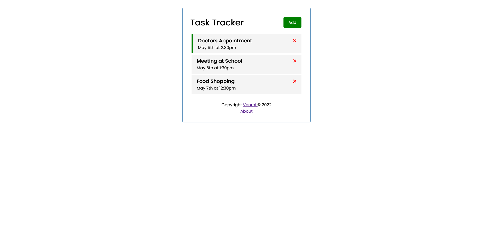

# Task Tracker using Angular

## Table of contents

- [Overview](#overview)
  - [Screenshot](#screenshot)
  - [Links](#links)
- [My process](#my-process)
  - [Built with](#built-with)
  - [What I learned](#what-i-learned)
- [Author](#author)

## Overview

### Screenshot

### Links

- Live Site URL: [TASK TRACKER](https://task-tracker-venrofi.netlify.app/)

## My process

### Built with

- HTML5
- SCSS
- [Angular](https://angular.io/) - JS library
- TypeScript

### What I learned

This was my very first Angular project and also using TypeScript. I got to know the syntax and structure of Angular framework, coming from React. I understand the basics, for example the process of creating components, adding routes, services. I used json-server library to emulate backend for the app. I know also how to disable certain DOM Elements for routes different than designed for.

## Author

- Website - [Radosław Terelak - Venrofi](https://venrofi.netlify.app/)
- Github - [@Venrofi](https://github.com/Venrofi)
- Twitter - [@RadekTerelak](https://twitter.com/RadekTerelak)
