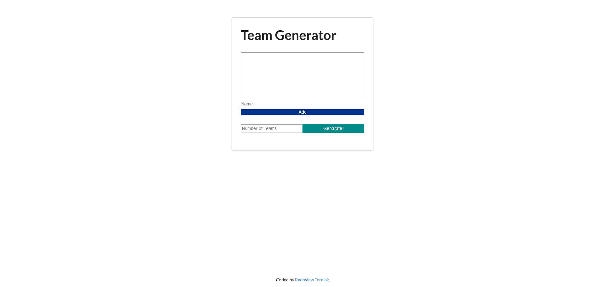

# Task Tracker using Angular

## Table of contents

- [Overview](#overview)
  - [Screenshot](#screenshot)
  - [Links](#links)
- [My process](#my-process)
  - [Built with](#built-with)
- [Author](#author)

## Overview

### Screenshot

### Links

- Live Site URL: [TEAM GENERATOR](https://team-generator-venrofi.netlify.app/)

## My process

### Built with

- HTML5
- SCSS
- [Angular](https://angular.io/) - JS library
- TypeScript

## Author

- Website - [Radosław Terelak - Venrofi](https://venrofi.netlify.app/)
- Github - [@Venrofi](https://github.com/Venrofi)
- Twitter - [@RadekTerelak](https://twitter.com/RadekTerelak)
