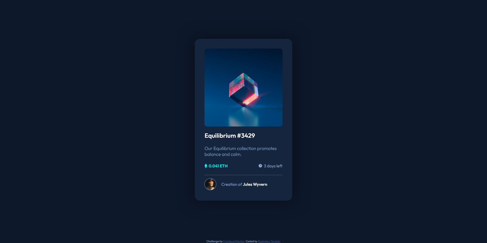

# Frontend Mentor - NFT preview card component solution

This is a solution to the [NFT preview card component challenge on Frontend Mentor](https://www.frontendmentor.io/challenges/nft-preview-card-component-SbdUL_w0U). Frontend Mentor challenges help you improve your coding skills by building realistic projects.

## Table of contents

- [Overview](#overview)
  - [The challenge](#the-challenge)
  - [Screenshot](#screenshot)
  - [Links](#links)
- [My process](#my-process)
  - [Built with](#built-with)
  - [What I learned](#what-i-learned)
  - [Continued development](#continued-development)
  - [Useful resources](#useful-resources)
- [Author](#author)
- [Acknowledgments](#acknowledgments)

## Overview

### The challenge

Users should be able to:

- View the optimal layout depending on their device's screen size
- See hover states for interactive elements

### Screenshot

### Links

- Solution URL: [Add solution URL here](https://your-solution-url.com)
- Live Site URL: [NFT-CARD-COMPONENT](https://nft-preview-card-component-venrofi.netlify.app/)

## My process

### Built with

- Semantic HTML5 markup
- CSS custom properties
- Flexbox

### What I learned

I refreshed my knowledge about responsive web designs. I learned how to make a hover state on an image.

### Continued development

In the next projects I will use SASS.

### Useful resources

- [Flexbox Malven](https://flexbox.malven.co/) - This helped me to use flexbox in my project correctly.

## Author

- Website - [Radosław Terelak - Venrofi](https://venrofi.netlify.app/)
- Frontend Mentor - [@Venrofi](https://www.frontendmentor.io/profile/Venrofi)
- Github - [@Venrofi](https://github.com/Venrofi)
- Twitter - [@RadekTerelak](https://twitter.com/RadekTerelak)
