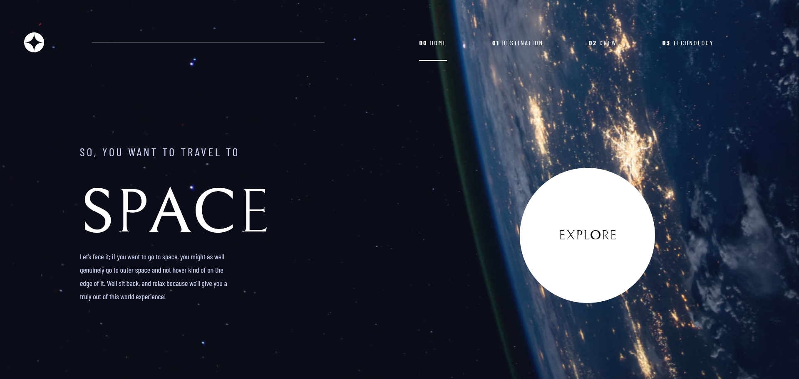

# Frontend Mentor - Space tourism website solution

This is a solution to the [Space tourism website challenge on Frontend Mentor](https://www.frontendmentor.io/challenges/space-tourism-multipage-website-gRWj1URZ3). Frontend Mentor challenges help you improve your coding skills by building realistic projects.

## Table of contents

- [Overview](#overview)
  - [The challenge](#the-challenge)
  - [Screenshot](#screenshot)
  - [Links](#links)
- [My process](#my-process)
  - [Built with](#built-with)
  - [What I learned](#what-i-learned)
- [Author](#author)

## Overview

### The challenge

Users should be able to:

- View the optimal layout for each of the website's pages depending on their device's screen size
- See hover states for all interactive elements on the page
- View each page and be able to toggle between the tabs to see new information

### Screenshot

### Links

- Live Site URL: [SPACE-TOURISM-WEBSITE](https://space-tourism-website-venrofi.netlify.app/)

## My process

To build this project I went over to Figma to better understand the design and all of the features.
Firstly, I've created \_general styles where I've included colors, typography and code that would repeat in each file like reset properties.
The next step was to build Home Page and style it following the design file.
It's important to remember about responsivity of all components especially for the mobile devices.
What was left to do were the subpages.

### Built with

- Semantic HTML5 markup
- SASS
- Flexbox

### What I learned

Use this section to recap over some of your major learnings while working through this project. Writing these out and providing code samples of areas you want to highlight is a great way to reinforce your own knowledge.

By completing this challenge I got to know how to translate a Figma design into working website. I've enhanced my knowledge in SASS, writting cleaner CSS.

## Author

- Website - [Radosław Terelak - Venrofi](https://venrofi.netlify.app/)
- Frontend Mentor - [@Venrofi](https://www.frontendmentor.io/profile/Venrofi)
- Github - [@Venrofi](https://github.com/Venrofi)
- Twitter - [@RadekTerelak](https://twitter.com/RadekTerelak)
